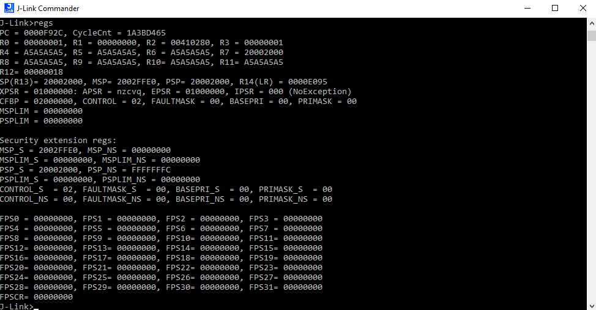

# Exercise 6 - Debugging a RTOS Application using JTAG(SWD) and GDB

The goal of this exercise is to make use of JTAG as a remote debugging tool. So in this exercise we are going to create a simple application and then use JTAG as to debug and analyse that application. To perform this exercise you are going to need the following:

* [LPCXpresso55S69 Development Board](https://www.nxp.com/design/development-boards/lpcxpresso-boards/lpcxpresso55s69-development-board:LPC55S69-EVK).
* [The Segger J-Link Adapter](https://www.segger.com/products/debug-probes/j-link/models/j-link-edu/).
* [A Cortex JTAG Connector](https://www.segger.com/products/debug-probes/j-link/accessories/adapters/9-pin-cortex-m-adapter/).
* [The GCC ARM Core Tool Chain](https://developer.arm.com/tools-and-software/open-source-software/developer-tools/gnu-toolchain/gnu-rm/downloads)

You will also need to download and install the [J-Link](https://www.segger.com/downloads/jlink/) software on your laptop.

## A Simple Applications
This exercise starts withe the development of a simple FreeRTOS application. Your application should make use of a single task that makes use of two functions. These functions simply add two numbers to together and then times the result by two. So your application should be structures as follows:

```c
//
// Define a function that add two numbers together.
int addition(int a, int b) {
  int result = 0;
  // result equals a plus  b
  return result;
}
//
// Define a function that multiples a number by two.
int multiples(int a) {
  int result = 0;
  // result equals a times 2
  return result;
}
//
// Definition of Task One
static void TaskOne(void *pvParameters)
{
  int result = 0;
  int counter = 0;
  while (TRUE) {
    for(counter, counter > 1024, counter++) {
      // result equals addition( counter , counter )
      // result equals multiples( counter )
    }
  }
}
```

Once you have created the FreeRTOS application, then download, and execute, it onto the LPCXpresso55S69 board using the GUI Flash tool located on the MCUXpresso tool bar.

## Using J-Link

Using the Cortex JTAG Connector connect the Segger J-Link Adapter to the LPCXpresso55S69 board, and then connect the Segger J-Link Adapter to your laptop. Once you have done this you can then execute the J-Link software. The Cortex JTAG Connector connect to P7 on the LPCXpresso55S69 board. A pin out description of the LPCXpresso55S69 board is given in the following diagram. If you are using the J-Link mini then you should be able to connect the J-Link mini directly to the LPCXpresso55S69 board. Please note that when connecting and executing the J-Link software you will be using SWD as the JTAG interface for the LPCXpresso55S69. SWD is ARM's implementation (and extension) of the JTAG standard.


Once the J-Link software is running you will need to select the device and as follows:
* LPC55S69_M33_0 (1 Core)/(Flash Size 631.5KB + 631.5K)

One you have select the default option for SWD with J-Link and select the correct LPC55S69_M33_0 core then J-Link should connect and give you the following:


Once the set up is complete that you can halt the CPU and examine the registers using the following commands:
* halt
* regs

These commands should produce the following:



One that you have halted the JJJ can you use the J-Link commands to step through the execution of the code, and examine memory content, set breakpoints.
* step - Execute steps in the CPU
* mem - Examine memory content
* setbp - Set a break point
* go - continue execution on the Computer

You should now use these comments to explore the contents of the stack as defined by the ARM registers.

# Tips and Hints
Information and help on programming in FreeRTOS can be found on the following links:
* [The FreeRTOS API and User Manuals](https://www.freertos.org/Documentation/RTOS_book.html)

Information and help on programming in C can be found on the following links:
* [Programming in C](https://beginnersbook.com/2014/01/c-program-structure/)
* [A C Tutorial](https://www.cprogramming.com/tutorial/c-tutorial.html?inl=nv)
* [Loops in C](https://www.tutorialspoint.com/cprogramming/c_loops.htm)

## Contact Details

For further information and questions please contact Dr Andrew Blyth, PhD. <ablyth@merimetso.net>
